# Provenance Guard Planning

## Project Goal

Provenance Guard is a Flask API that accepts creator-submitted content, runs multiple attribution signals, combines those signals into a confidence score, produces a plain-language transparency label, and stores the full decision trail in a structured audit log. The system is intentionally conservative about calling content AI-generated because a false positive is more harmful than a false negative on a writing platform.

## Architecture

### Narrative

When a creator submits content, the API validates the payload, assigns a `content_id`, and sends the content through three detection signals: a Groq-based holistic classifier, a stylometric heuristic scorer, and a lexical formality scorer. Those signal outputs are combined into a single confidence score, translated into an attribution category and plain-language transparency label, persisted in SQLite alongside the original content, and written to the audit log before the response is returned.

When a creator appeals a decision, the API locates the original submission by `content_id`, stores the creator's reasoning, updates the content status to `under_review`, writes a new structured audit entry linked to the original decision, and returns a confirmation response. The reviewer-facing record is the combined content row plus its associated audit history.

### Diagram

```mermaid
flowchart TB
    subgraph submitFlow [Submission Flow]
        postSubmit["POST /submit or /submit/metadata"] --> validatePayload["Validate payload + assign content_id"]
        validatePayload --> groqSignal["Groq LLM signal"]
        validatePayload --> stylometricSignal["Stylometric signal"]
        validatePayload --> lexicalSignal["Lexical formality signal"]
        groqSignal --> ensembleScore["Weighted ensemble + disagreement dampening"]
        stylometricSignal --> ensembleScore
        lexicalSignal --> ensembleScore
        ensembleScore --> attributionMapper["Attribution category + transparency label"]
        attributionMapper --> sqliteStore["SQLite content + audit log"]
        sqliteStore --> submitResponse["JSON response"]
    end

    subgraph appealFlow [Appeal Flow]
        postAppeal["POST /appeal"] --> locateContent["Find content by content_id"]
        locateContent --> statusUpdate["Set status to under_review"]
        statusUpdate --> appealAudit["Write structured appeal log entry"]
        appealAudit --> appealResponse["JSON confirmation"]
    end
```



## API Surface

### Required endpoints

- `POST /submit`
  - Input: `text`, `creator_id`
  - Output: `content_id`, `attribution`, `confidence`, `label`, `signals`, `status`
- `POST /appeal`
  - Input: `content_id`, `creator_reasoning`
  - Output: confirmation, updated `status`
- `GET /log`
  - Output: recent structured audit entries

### Stretch endpoints

- `POST /submit/metadata`
  - Input: `content_type`, `creator_id`, plus `image_description` or structured metadata text
  - Output: same attribution shape as `POST /submit`
- `POST /certificate/verify`
  - Input: `creator_id`, `verification_text`
  - Output: verification result, badge eligibility
- `GET /dashboard`
  - Output: analytics dashboard view
- `GET /content/<content_id>`
  - Output: content details including any verified-human badge state

## Detection Signals

### Signal 1: Groq LLM classification

- Model: `llama-3.3-70b-versatile`
- What it measures:
  - holistic semantic coherence
  - generic or templated phrasing
  - overly balanced, polished "AI voice"
- Why it helps:
  - it can notice high-level stylistic patterns that simple heuristics miss
- Output:
  - normalized `ai_likelihood` score from `0.0` to `1.0`
  - short rationale string for debugging and logging
- What it misses:
  - non-native but formal human writing
  - carefully edited human essays
  - human content that intentionally imitates polished assistant output

### Signal 2: Stylometric heuristics

- What it measures:
  - sentence length variance
  - type-token ratio
  - punctuation density
- Why it helps:
  - AI text often stays structurally uniform, while human writing usually has more irregularity
- Output:
  - normalized `ai_likelihood` score from `0.0` to `1.0`
  - component metrics in the log for inspection
- What it misses:
  - poetry
  - chatty dialogue
  - bullet lists
  - short texts with too little structure for reliable measurement

### Signal 3: Lexical formality

- What it measures:
  - density of transition phrases and formulaic connectors such as `furthermore`, `additionally`, `it is important to note`, and similar stock phrases
- Why it helps:
  - many AI-written paragraphs overuse connective scaffolding and generic transitions
- Output:
  - normalized `ai_likelihood` score from `0.0` to `1.0`
- What it misses:
  - academic human essays
  - business writing
  - technical writing where such transitions are genuinely appropriate

## Signal Combination and Confidence Scoring

Each signal returns `ai_likelihood` in the range `[0, 1]`, where higher means more likely AI-generated.

### Ensemble formula

Base weighted score:

```text
combined = (groq * 0.45) + (stylometric * 0.30) + (lexical * 0.25)
```

### Disagreement dampening

If the spread between the highest and lowest signal is greater than `0.35`, the system pulls the combined score partway toward `0.50` to represent uncertainty instead of overcommitting. This is a deliberate false-positive safeguard.

One implementation-ready version:

```text
if max(signals) - min(signals) > 0.35:
    combined = (combined * 0.7) + (0.50 * 0.3)
```

### Thresholds

- `confidence >= 0.72` -> `likely_ai`
- `confidence <= 0.38` -> `likely_human`
- otherwise -> `uncertain`

### What specific scores mean

- `0.20` means the system sees several human-leaning signals and is comfortable labeling the content likely human-written.
- `0.60` means the content leans AI according to some checks, but not strongly enough for a confident AI label.
- `0.88` means multiple signals agree that the text reads like AI-assisted output.

### Validation plan

I will validate score meaning with at least four deliberately different test inputs:

1. Clearly AI-generated formal paragraph
2. Clearly human-written casual paragraph
3. Formal human writing that may trigger some AI-like heuristics
4. Lightly edited AI output that should stay in the middle range

The goal is not perfect detection. The goal is that obviously different cases produce noticeably different scores and that disagreement moves borderline cases into `uncertain`.

## Transparency Label Design

The label text must be plain language and must change meaningfully across categories.

- High-confidence AI:
  - `"Likely created with AI assistance. Multiple checks agree, and we are confident in this assessment."`
- Uncertain:
  - `"Origin unclear. We could not confidently tell whether a person or AI wrote this. The creator can request a human review."`
- High-confidence human:
  - `"Likely written by a person. Multiple checks agree, and we are confident in this assessment."`

These labels avoid technical terms like classifier, logits, or probability calibration. The uncertain variant explicitly explains that the system could not tell confidently and points to appeal/review.

## Appeals Workflow

### Who can appeal

Any creator who has a `content_id` from a prior submission can appeal that result.

### Appeal input

- `content_id`
- `creator_reasoning`

### System behavior on appeal

1. Validate that the content exists.
2. Update the content status to `under_review`.
3. Store the creator's reasoning on the content record or in a linked appeal record.
4. Write a structured audit entry that includes:
   - timestamp
   - `content_id`
   - original attribution
   - original confidence
   - `status: under_review`
   - `appeal_reasoning`
5. Return a confirmation response.

### What a human reviewer would see

A reviewer would need:

- the original submitted content
- creator ID
- attribution result
- confidence score
- individual signal scores
- previous status
- appeal reasoning
- full audit timeline for that content

## Audit Log Design

The audit log will be structured and queryable through `GET /log`. Each classification entry should include:

- `content_id`
- `creator_id`
- `timestamp`
- `content_type`
- `attribution`
- `confidence`
- `groq_score`
- `stylometric_score`
- `lexical_score`
- `label`
- `status`

Appeal entries will additionally include:

- `appeal_reasoning`
- `event_type: appeal`

This log will live in SQLite, with JSON-ready rows returned by the API.

## Rate Limiting

Planned limit:

- `10 per minute; 100 per day` per IP on `POST /submit` and `POST /submit/metadata`

Rationale:

- a real writer might submit several drafts in a short burst while revising
- `10 per minute` allows a quick retry loop without enabling easy spam
- `100 per day` is generous for normal platform usage but restrictive for bulk abuse or scraping-style misuse

## Anticipated Edge Cases

1. Repetitive poetry or chant-like writing may look AI-generated because sentence length variance and vocabulary diversity can be unusually low on purpose.
2. Formal human academic prose may overuse transition phrases and balanced structure, which could push both the lexical and LLM signals toward AI.
3. Very short submissions may not contain enough structure for reliable stylometric scoring, so the system should either down-weight that signal or reflect extra uncertainty.
4. Lightly edited AI output may keep a human-looking surface while still reflecting AI organization, which can create meaningful disagreement between signals.

## Stretch Features Plan

### Ensemble detection

The base system already uses three signals. The stretch work is to expose all three individual scores in the API response, audit log, and README, while documenting the weighting and disagreement handling clearly.

### Provenance certificate

Creators can submit a short verification sample through `POST /certificate/verify`. If that sample is classified as likely human with confidence at or below `0.38`, the creator earns a verified-human badge. Future content from that creator will show a distinct verified label in addition to the normal transparency label.

### Analytics dashboard

The dashboard will display at least:

- ratio of `likely_ai` vs `likely_human` vs `uncertain`
- appeal rate
- average confidence score

The dashboard may also include total submissions and verified creators as helpful supporting metrics.

### Multi-modal support

The second content type will be metadata-driven submissions such as image descriptions or structured descriptive text. The pipeline will reuse the same three-signal framework, but the prompt and weighting can be adjusted so the Groq signal interprets alt-text-style inputs correctly.

## AI Tool Plan

### M3: submission endpoint + first signal

- Spec sections to provide:
  - Detection Signals
  - Architecture
  - API Surface
- Ask the AI tool to generate:
  - Flask app skeleton
  - `POST /submit` route stub
  - Groq signal helper returning a structured score
  - SQLite log helper
- Verification:
  - run the Groq signal on a few direct test strings before wiring it into the route
  - confirm route response shape matches the API contract

### M4: second signal + confidence scoring

- Spec sections to provide:
  - Detection Signals
  - Signal Combination and Confidence Scoring
  - Architecture
- Ask the AI tool to generate:
  - stylometric scoring function
  - lexical scoring function
  - ensemble scoring helper
- Verification:
  - print individual signal scores for the four test cases
  - confirm clearly different inputs produce meaningfully different combined scores
  - confirm disagreement cases move toward `uncertain`

### M5: production layer

- Spec sections to provide:
  - Transparency Label Design
  - Appeals Workflow
  - Audit Log Design
  - Architecture
- Ask the AI tool to generate:
  - label mapping helper
  - `POST /appeal` endpoint
  - rate limiter wiring
- Verification:
  - force all three label categories with sample inputs
  - verify appeal updates `status` to `under_review`
  - verify rate limit produces `429`

## Implementation Notes

- Use Flask for the API.
- Use SQLite for content storage and structured audit logs.
- Use `Flask-Limiter` with `storage_uri="memory://"` for local development.
- Keep the response JSON explicit enough that graders can see both individual signals and the combined score.
- Update this planning document before implementing any stretch feature changes that materially alter scope or behavior.
